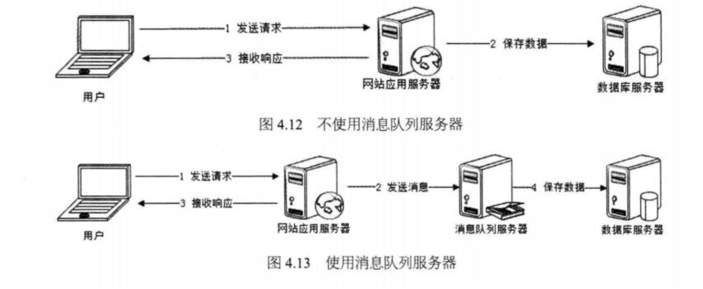

# 消息队列MQ

[TOC]

## 消息队列产生的背景：通过异步处理提高系统性能

如上图，在不使用消息队列服务器的时候，用户的请求数据直接写入数据库，在高并发的情况下数据库压力剧增，使得响应速度变慢。

但是在使用消息队列之后，

- 用户的请求数据发送给消息队列之后立即返回，
- 再由消息队列的消费者进程从消息队列中获取数据，异步写入数据库。由于消息队列服务器处理速度快于数据库(消息队列也比数据库有更好的伸缩性)，因此响应速度得到大幅改善。

通过以上分析可以得出：**消息队列具有很好的削峰作用的功能**——即通过异步处理，将短时间高并发产生的事务消息存储在消息队列中，从而削平高峰期的并发事务。 举例：在电子商务一些秒杀、促销活动中，合理使用消息队列 可以有效抵御促销活动刚开始大量订单涌入对系统的冲击。如下图所示:

因为用户请求数据写入消息队列之后就立即返回给用户了，但是请求数据在后续的业务校验、写数据库等操作中可能 失败。因此使用消息队列进行异步处理之后，需要适当修改业务流程进行配合，比如用户在提交订单之后，订单数据

## 消息队列的主要作用：

- 异步消息：如发短信、发邮件、推微信；

- 应用解耦：分解耗时操作，使其异步处理，如下订单与减库存；

- 流量削峰：如秒杀场景；
- 其他：日志处理、消息通讯、作业调度(定时跑批任务)；

## 消息队列的协议

### 1 JMS 

JMS是一个与服务平台无关的API，绝大多数MOM提供商，都对JMS提供支持。（作用类似于JDBC）

#### Point to Point(简称P2P，点对点)

角色：

- 消息队列

- 发送者

- 接受者

特点：

- 每个消息只有一个消费者；
- 发送者和接受者在时间上没有依赖性：也就是说发送者发送了消息之后，不管接收者有没有正在运行，不影响消息备发送到队列。
- 接受者在成功接受消息之后，需要向队列应答成功。

> 每个消息都被发送到一个特定的队列，接收者从队列中获取消息，队列保留着消息，直到他们被消费或超时。

总结：

如果希望发送到每个消息都被成功消费，那么需要使用p2p模型；

#### Publish/Subscribe (发布订阅)

角色：

- 主题（Topic）
- 发布者（Publisher）
- 订阅者（Subscriber）

特点：

- 每个消息，可以有多个消费者；
- 发布者和消费者之间有时间上的依赖。对某主题的订阅者，必须先订阅，才能消费发布者发布的消息；
- 为了消费消息，订阅者必须保持运行的状态；

> 为了缓和这样严格的时间依赖性，JMS允许订阅者创建一个可持久化的订阅，这样，即使订阅者没有被激活(运行)，它也能接收到发布者的消息。

总结：

如果希望发送的消息可以被多个消费者处理的话，那么可以采用Pub/Sub模式。

## 消息中间件选择

- 大数据 ：kafka-吞吐量最大

- 物联网：EMQ

- 常规开发：RabbitMQ-可靠性最好

  

## RabbitMQ

支持协议：基于AMQP协议，通过插件支持JMS协议等。

特点：高并发、高性能、高可用；

