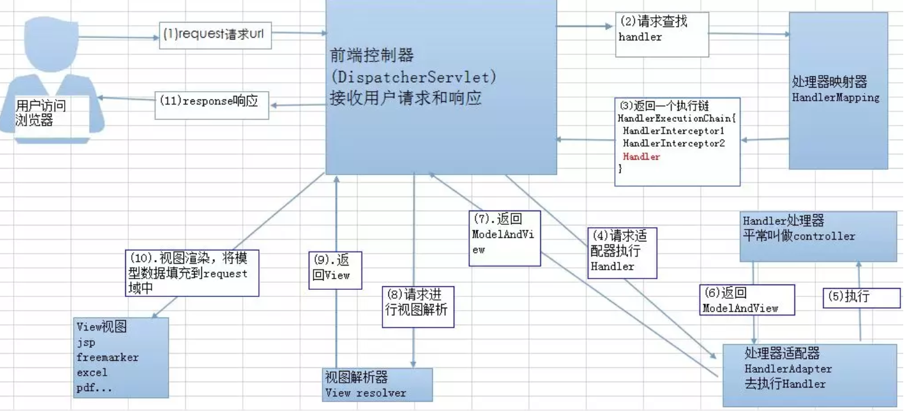

# Spring全家桶

  官方文档：

- https://docs.spring.io/spring-framework/docs/current/spring-framework-reference/core.html#spring-core

- https://docs.spring.io/spring-framework/docs/current/spring-framework-reference/

## 概念

**概念：**Spring是一个全面的、企业应用开发一站式的解决方案，贯穿表现层、业务层、持久层。但是 Spring仍然可以和其他的框架无缝整合。

**特点**：是一个**轻量级**的**控制反转（IoC）和面向切面（AOP）**的**容器**，是基于Java的 开发框架的集合。

### 区分 Spring 家族成员：

- **Spring** 是专业开发web项目的开源框架的集合。

- **SpringMVC** 是 Spring内部的一个模块(module)，同样采取 MVC 设计模式。 所以在使用 Spring 开发web项目时，作为核心环节的 MVC 可以使用struts1 / struts2 / SpringMVC。

- **Spring Boot** 是 Build Anything；实现自动默认配置，降低项目搭建的复杂度。https://spring.io/quickstart 这里可以自动生成初始项目，可导入IDE直接使用。

- **Spring Cloud** 是 Coordinate Anything；在Spring Boot基础之上构建的，用于快速构建分布式系统的通用模式的工具集。 其次，使用Spring Cloud开发的应用程序非常适合在Docker和PaaS（比如Pivotal Cloud Foundry）上部署，所以又叫做云原生应用（Cloud Native Application）。

### 区分 jpa(接口) 和 hibernate（实现）： 

- JPA 即 Java Persistence API，是Java EE 5的标准ORM（Object Relation Map，对象关系映射）接口，也是ejb3规范的一部分。
- Hibernate 是当今很流行的ORM框架，是JPA的一个实现，但其功能是JPA的超集。
- JPA 和 Hibernate之间的关系，可以简单的理解为 JPA 是标准接口，Hibernate是实现。那么Hibernate 与 JPA 的这种关系主要是通过三个组件来实现的：hibernate-annotation、hibernate-entitymanager、hibernate-core。

### SpringMVC

客户端发送请求-> 前端控制器 DispatcherServlet 接受客户端请求 -> 找到处理器映射 HandlerMapping 解析请求对 应的 Handler-> HandlerAdapter 会根据 Handler 来调用真正的处理器开处理请求，并处理相应的业务逻辑 -> 处理 器返回一个模型视图 ModelAndView -> 视图解析器进行解析

 -> 返回一个视图对象->前端控制器 DispatcherServlet 渲染数据(Model)->将得到视图对象返回给用户

## AOP(Aspect Oriented Programming)面向切面编程

传统OOP(面向对象编程)中的路基代码是自上而下的。在此过程中会产生横切性问题(controller执行时长，servcie权限控制、DAO层事务等)，而这些横切性问题又与我们的主业务逻辑关系不大，会散落在各处难以维护。

> OOP自上而下的结构：browser(login) > [controller(执行时长日志) > service(权限控制)> DAO(事务)] > DB

面向切面编程，将这些横切性问题与主业务逻辑进行分离，从而起到解欧的目的。

AOP是一种思想而不是一种技术，它的实现一般都是基于代理模式 。在Java中一般采用Jdk动态代理模式，但是Jdk动态代理模式只能代理接口而不能代理类。因此，Spring AOP 同时支持 CGLIB、 ASPECTJ、JDK动态代理，会根据情况进行切换。

> 因为jdk动态代理生成的类都是形如：`final class $Proxy0 extends Proxy implements IXx`
>
> 是必须继承Proxy类，又因为Java是单继承的，所以Jdk只能实现接口类。

- 如果目标对象的实现类实现了接口：Spring AOP 将会采用 JDK 动态代理来生成 AOP 代理类; 

  JdkDynamicProxy

- 如果目标对象的实现类没有实现接口：Spring AOP 将会采用 CGLIB 来生成 AOP 代理类；不过这个选择过程 对开发者完全透明、开发者也无需关心。

  ObjenessCglibAopProxy

这部分内容可以查看下面这几篇文章:

https://www.jianshu.com/p/fe8d1e8bd63e 

http://www.cnblogs.com/puyangsky/p/6218925.html

https://juejin.im/post/5a55af9e518825734d14813f

> 静态代理：
>
> 动态代理：

## IoC(Inverse of Control,控制反转)

### 概念

**所谓 IOC ，就是由 Spring IOC 容器来负责对象的生命周期和对象之间的关系。**

IOC不是什么技术，而是一种设计思想。在Java开发中，Ioc意味着将设计好的对象交给容器控制，而不是传统的在对象内部直接控制。

Spring IOC的初始化过程:

> XML =读取> Resource  =解析> BeanDefination  =注册> BeanFactory

IOC源码阅读：https://javadoop.com/post/spring-ioc

### DI(Dependency Injection,依赖注入) - @Autowired

**@Autowired**

Marks a constructor, field, setter method, or config method as to be autowired by Spring's dependency injection facilities. This is an alternative to the JSR-330 {@link javax.inject.Inject} annotation, adding required-vs-optional semantics.

## Spring Bean的作用域：

- **singleton** ：缺省设置，在Spring IoC中仅存在一个实例；
- **prototype**：每次从容器中调用Bean时，都会返回一个新实例（相当于执行new  XBean()）；
- **request**：（仅作用于WebApplicationContext环境）每次http请求都会创建一个新的bean；
- **session**：（仅作用于WebApplicationContext环境）同一个http session共享一个bean，不同session使用不同bean；
- **globalSession**：（仅作用于WebApplicationContext环境）一般用于Portlet应用环境。

## 事务

### Spring中事务的隔离级别

TransactionDefinition 接口中定义了五个表示隔离级别的常量:

- TransactionDefinition.ISOLATION_DEFAULT: 使用后端数据库默认的隔离级别（Mysql 默认采用的 REPEATABLE_READ隔离级别，Oracle 默认采用的 READ_COMMITTED隔离级别）。
- TransactionDefinition.ISOLATION_READ_UNCOMMITTED: 最低的隔离级别，允许读取尚未提交的数据变更，可能会导致脏读、幻读或不可重复读；
- TransactionDefinition.ISOLATION_READ_COMMITTED: 允许读取并发事务已经提交的数据，可以阻止脏读，但是幻读或不可重复读仍有可能发生；
- TransactionDefinition.ISOLATION_REPEATABLE_READ: 对同一字段的多次读取结果都是一致的，除非数据是被本身事务自己所修改，可以阻止脏读和不可重复读，但幻读仍有可能发生。 
- TransactionDefinition.ISOLATION_SERIALIZABLE: 最高的隔离级别，完全服从ACID的隔离级别。所有的事 务依次逐个执行，这样事务之间就完全不可能产生干扰，也就是说，该级别可以防止脏读、不可重复读以及幻 读。但是这将严重影响程序的性能。通常情况下也不会用到该级别。

### Spring 中事务的传播行为

**支持当前事务的情况:**

- TransactionDefinition.PROPAGATION_REQUIRED: 如果当前存在事务，则加入该事务;如果当前没有事 务，则创建一个新的事务。
- TransactionDefinition.PROPAGATION_SUPPORTS: 如果当前存在事务，则加入该事务;如果当前没有事 务，则以非事务的方式继续运行
- TransactionDefinition.PROPAGATION_MANDATORY: 如果当前存在事务，则加入该事务;如果当前没有 事务，则抛出异常。(mandatory:强制性) **不支持当前事务的情况:**
- TransactionDefinition.PROPAGATION_REQUIRES_NEW: 创建一个新的事务，如果当前存在事务，则把当 前事务挂起。
- TransactionDefinition.PROPAGATION_NOT_SUPPORTED: 以非事务方式运行，如果当前存在事务，则把 当前事务挂起。
- TransactionDefinition.PROPAGATION_NEVER: 以非事务方式运行，如果当前存在事务，则抛出异常。 **其他情况:**
- TransactionDefinition.PROPAGATION_NESTED: 如果当前存在事务，则创建一个事务作为当前事务的嵌套事务来运行;如果当前没有事务，则该取值等价于TransactionDefinition.PROPAGATION_REQUIRED。