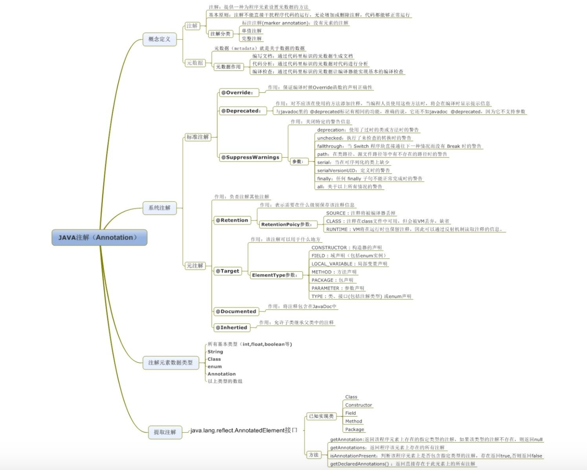

# Java 注解（Annotation）



官方文档： [Java Annotation](https://docs.oracle.com/javase/tutorial/java/annotations/QandE/questions.html)

## 概念

Java 注解（Annotation，又叫标注），是 JDK5.0 引入的一种对元数据的支持。注解与注释是有一定区别的，可以把注解理解为代码里的特殊标记，这些标记可以在编译，类加载，运行时被读取，并执行相应的处理。通过注解开发人员可以在不改变原有代码和逻辑的情况下在源代码中嵌入补充信息。

**Annatation是一个接口**，程序可以通过反射来获取指定程序中元素的 Annotation对象，然后通过该 Annotation 对象来获取注解中的元数据信息。


## 4个元注解-负责注解其他注解

Java5.0 定义了 4 个标准的**元注解(meta-annotation)**类型，它们只能用于注解，提供对其它注解(annotation)类型作说明。

##### **@Target** 定义所修饰注解的作用**对象范围**: 

Annotation的ElementType可以是：

- TYPE 意味着，它能标注"类、接口（包括注释类型）或枚举声明"。
- FIELD 意味着，它能标注"字段声明"。
- METHOD 意味着，它能标注"方法"。
- PARAMETER 意味着，它能标注"参数"。
- CONSTRUCTOR 意味着，它能标注"构造方法"。
- LOCAL_VARIABLE 意味着，它能标注"局部变量"。

```java
import java.lang.annotation;
/* @since 1.5
 * @jls 9.6.4.1 @Target
 * @jls 9.7.4 Where Annotations May Appear
 * @jls 9.7.5 Multiple Annotations of the Same Type
 */
@Documented
@Retention(RetentionPolicy.RUNTIME)
@Target(ElementType.ANNOTATION_TYPE)
public @interface Target {
    /**
     * Returns an array of the kinds of elements an annotation type
     * can be applied to.
     * @return an array of the kinds of elements an annotation type
     * can be applied to
     */
    ElementType[] value();
}
```

##### **@Retention**  定义所修饰的注解的**被保留的时间长短(生命周期)**:

Annotation的RetentionPolicy 取值可以是:

- SOURCE: 在源文件中有效(即源文件保留)

- CLASS: 在 class 文件中有效(即 class 保留)

- RUNTIME: 在运行时有效(即运行时保留)

```java
package java.lang.annotation;
 /*
 * @since 1.5
 * @jls 9.6.4.2 @Retention
 */
@Documented
@Retention(RetentionPolicy.RUNTIME)
@Target(ElementType.ANNOTATION_TYPE)
public @interface Retention {
    // @return the retention policy
    RetentionPolicy value();
}
```

##### **@Inherited** 表示所修饰的注解，**是有继承性的**。

```java
package java.lang.annotation;
/* @since 1.5
 * @jls 9.6.4.3 @Inherited
 */
@Documented
@Retention(RetentionPolicy.RUNTIME)
@Target(ElementType.ANNOTATION_TYPE)
public @interface Inherited {
}
```

##### **@Documented**  表示所修饰的标注，**可以被javadoc等工具文档化**。

```java
package java.lang.annotation;
//@since 1.5
@Documented
@Retention(RetentionPolicy.RUNTIME)
@Target(ElementType.ANNOTATION_TYPE)
public @interface Documented {
}
```


## 3个作用在代码的注解

##### **@Override** - 检查**方法**是否是重写方法。

如果发现其父类或者是引用的接口中并没有该方法时，会报编译错误。

```java
 /*
 * @since 1.5
 */
@Target(ElementType.METHOD)
@Retention(RetentionPolicy.SOURCE)
public @interface Override {
}
```

##### **@Deprecated** - 标记所修饰对象是过时的。

如果使用该方法，会报编译警告。

```java
/*
 * @since 1.5
 * @jls 9.6.4.6 @Deprecated
 */
@Documented
@Retention(RetentionPolicy.RUNTIME)
@Target(value={CONSTRUCTOR, FIELD, LOCAL_VARIABLE, METHOD, PACKAGE, MODULE, PARAMETER, TYPE})
public @interface Deprecated {
    /* Returns the version in which the annotated element became deprecated. The version string is in the same format and namespace as the value of the {@code @since} javadoc tag. The default value is the empty string.
     * @return the version string
     * @since 9
     */
    String since() default "";

    /* Indicates whether the annotated element is subject to removal in a future version. The default value is {@code false}.
     * @return whether the element is subject to removal
     * @since 9
     */
    boolean forRemoval() default false;
}
```

##### **@SuppressWarnings** - 指示编译器去忽略注解中声明的警告。

用法如@SuppressWarnings(value={"deprecation"})，SuppressWarnings 常用的关键字可以是：

> deprecation  -- 使用了不赞成使用的类或方法时的警告
> unchecked    -- 执行了未检查的转换时的警告，例如当使用集合时没有用泛型 (Generics) 来指定集合保存的类型。
> fallthrough  -- 当 Switch 程序块直接通往下一种情况而没有 Break 时的警告。
> path         -- 在类路径、源文件路径等中有不存在的路径时的警告。
> serial       -- 当在可序列化的类上缺少 serialVersionUID 定义时的警告。
> finally      -- 任何 finally 子句不能正常完成时的警告。
> all          -- 关于以上所有情况的警告。

```java
/*
 * @since 1.5
 * @jls 4.8 Raw Types
 * @jls 4.12.2 Variables of Reference Type
 * @jls 5.1.9 Unchecked Conversion
 * @jls 5.5.2 Checked Casts and Unchecked Casts
 * @jls 9.6.4.5 @SuppressWarnings
 */
@Target({TYPE, FIELD, METHOD, PARAMETER, CONSTRUCTOR, LOCAL_VARIABLE, MODULE})
@Retention(RetentionPolicy.SOURCE)
public @interface SuppressWarnings {
    /**
     * The set of warnings that are to be suppressed by the compiler in the annotated element.  Duplicate names are permitted.  The second and successive occurrences of a name are ignored.  The presence of unrecognized warning names is <i>not</i> an error: Compilers must ignore any warning names they do not recognize.  They are, however, free to emit a warning if an annotation contains an unrecognized warning name.
     *
     * <p> The string {@code "unchecked"} is used to suppress
     * unchecked warnings. Compiler vendors should document the
     * additional warning names they support in conjunction with this
     * annotation type. They are encouraged to cooperate to ensure
     * that the same names work across multiple compilers.
     * @return the set of warnings to be suppressed
     */
    String[] value();
}
```

 


## Java 7 新添加了 3 个注解

##### **@SafeVarargs** 

Java 7 开始支持，忽略任何使用参数为泛型变量的方法或构造函数调用产生的警告。

##### **@FunctionalInterface** 

Java 8 开始支持，标识一个匿名函数或函数式接口。

##### **@Repeatable** 

Java 8 开始支持，标识某注解可以在同一个声明上使用多次。


