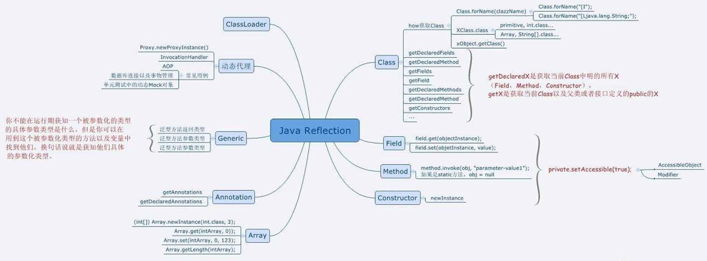

# Java语言的反射机制

## 动态语言

动态语言，是指在程序运行时可以改变其结构，如：新函数可以被引进，已有函数可以被删除等结构上的变化。

比如常见的 JavaScript 就是动态语言，除此之外 Ruby,Python 等也属于动态语言，而 C、C++则不属于动态语言。从反射角度说， **Java 属于半动态语言**。


## Java语言的反射机制

### 概念

JAVA反射机制是指：在运行状态中，对于任意一个类，都能都知道这个类的所有属性和方法，并且对于任意一个对象，都能够调用它的任意一个方法和属性；这种动态获取信息以及动态调用对象的方法的功能，称为java语言的反射机制；




### 反射的作用/应用场景

通过反射机制可以访问java对象中的属性、方法、构造方法。

 Java 程序中，许多对象在运行是都会出现两种类型：编译时类型和运行时类型。 编译时的类型由声明对象时实用的类型来决定，运行时的类型由实际赋值给对象的类型决定 。如:

```
Person p=new Student(); //其中编译时类型为 Person，运行时类型为 Student。
```

程序在运行时还可能接收到外部传入的对象，该对象的编译时类型为 Object，但是程序有需要调用该对象的运行时类型的方法。为了解决这些问题，程序需要在运行时发现对象和类的真实信息。然而，如果编译时根本无法预知该对象和类属于哪些类，程序只能依靠运行时信息来发现该对象和类的真实信息，此时就必须使用到反射了。

```
Person p = new Student(1, "Lily", 80);
//Person有两个属性：id和name， Student有三个属性：id，name和score。
System.out.println(p.getName());
System.out.println(((Student)p).getScore());

output:
Lily
80
```


### Java反射API

反射 **API** 用来生成 **JVM** 中的类、接口或则对象的信息。SUN提供的反射相关的类：

- final class  java.lang.Class<T> ：

​       是反射的核心类，Class类的实例表示正在运行的Java程序中的实例和接口。通过Class类获取类后，可以获取并查看类的属性、方法等信息；

枚举类型是一种类，注释类型是一种接口。每个数组也属于反映为Class对象的类，由具有相同元素类型和尺寸大小的所有数组共享。原始Java类型  boolean、byte、char}、short、int、long、float和 double，关键字void 也是表示为 Class对象。

- final class java.lang.reflect.Constructor<T> ：

  用来提供信息或者访问类的构造方法；

- final class java.lang.reflect.Field ：

  用来提供信息或者访问 类或接口类 的 成员变量/属性；

- java.lang.reflect.Method：

  用来提供信息或者访问 类或接口类 的 方法；反射的方法可以是类方法或者实例方法（包括接口方法）；

- final class java.lang.reflect.Modifier：

  提供 static 方法和常量，用于解码类和成员访问修饰符。

  

### 反射的操作步骤

1 获取想要操作的类的 Class 对象，它是反射的核心，通过 Class 对象我们可以任意调用类的方法和属性。

2 反射的使用阶段：调用 Class 类中的方法；

3 使用反射API来操作这些信息。


### 获取Class对象的三种方式

#### 1 使用 Class 类中的 forName() 静态方法(最安全/性能最好)

```
 Class clazz = Class.forName("base.Person"); //(最常用)
```

#### 2 调用某个类的 class 属性来获取该类对应的 Class 对象

```
Class clazz = Person.class;
```

#### 3 调用某个对象的 getClass() 方法

```
Person p = new Person();
Class clazz = p.getClass();
```

实战：

```java
 public static void main(String[] args) {
             //方法2：(对象.getClass())，获取person类中的字节码文件
   					 Person p1 = new Person(1, "Lucy");
             Person p2 = new Person(2, "Tom");
             Class class1 = p1.getClass();
             System. out.println(p1.getClass().getName());
             Class class2 = p2.getClass();
             System. out.println(class1 == class2 );    
   
   					 //方法2 (类.class:需要输入一个明确的类，任意一个类型都有一个静态的class属性)
             Class class3 = Person.class;
             System.out.println(class1 == class3);
   
   					 //方法1(forName():传入时只需要以字符串的方式传入即可)
             //通过Class类的一个forName（String className)静态方法返回一个Class对象，className必须是全路径名称；
             Class class4 = null;
             try {
                class4 = Class.forName("cn.itcast.Person");
                System. out.println(class4 == class3);
             } catch (ClassNotFoundException e) {
                e.printStackTrace();
             }
}

输出：
base.Person
true
true
true
```


### 创建对象的两种方法

#### 1 Class 对象的 newInstance() (自 Jdk1.9 开始弃用)

使用 Class 对象的 newInstance()方法来创建该 Class 对象对应类的实例，但是这种方法要求该 Class 对象对应的类**有默认的空构造器**。

#### 2 调用Constructor对象的newInstance()

先使用 Class 对象获取指定的 Constructor 对象，再调用 Constructor 对象的 newInstance()方法来创建 Class 对象对应类的实例，通过这种方法可以选定构造方法创建实例。

**注意**：以上两种方法都要求对类的构造方法有访问权限，也就是构造方法不能是private。

```
public class Test {
	public static void main(String[] args) {
		try {
			Class clas = Class.forName("base.Person");
			//Person p = (Person) clas.newInstance();
			Constructor c = clas.getDeclaredConstructor(int.class, String.class);
			Person p = (Person) c.newInstance(1, "Lily");			
			System.out.println(p.getId() + " | " + p.getName());
		} catch (Exception  e) {
			System.err.println(e.getMessage());
			e.printStackTrace(System.err);
		} 	
	}
}

output:
1 | Lily
```


```

public class Person {
	private int id;
	private String name;
	pulic Person(int id, String name)
	{
		this.id = id;
		this.name = name;
	}

	public int getId() {
		return id;
	}
	public void setId(int id) {
		this.id = id;
	}

	public String getName() {
		return name;
	}
	public void setName(String name) {
		this.name = name;
	}
}
```

