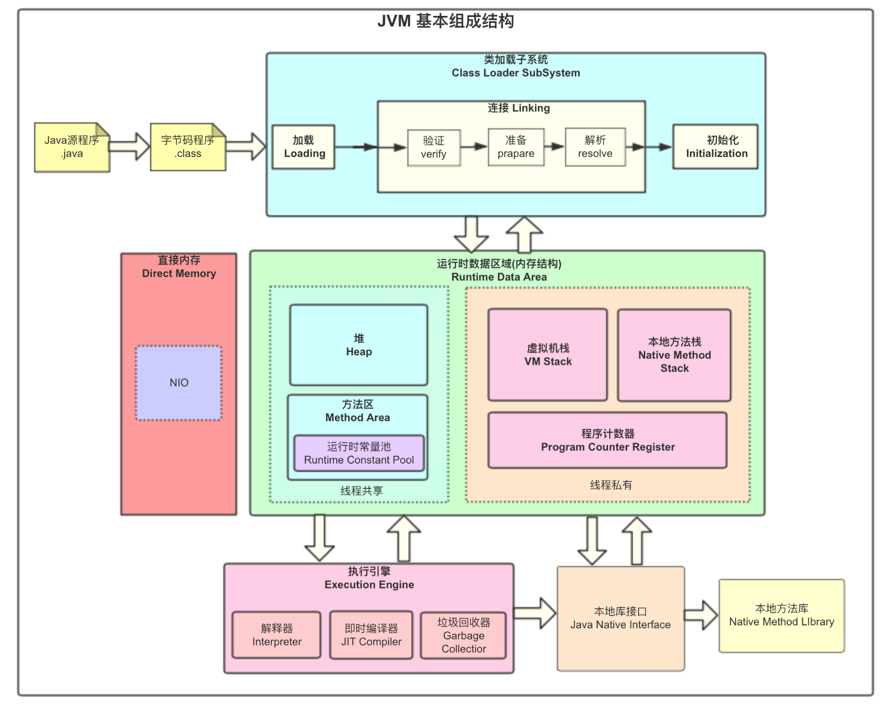

# JVM

**参考：**书籍《深入理解JVM虚拟机（第三版）周志明》

- [JVM、HotSpot、JDK/OpenJDK](##JVM、HotSpot、JDK/OpenJDK)

- [JVM标准规范](##JVM标准规范)

- [JVM基本结构](JVM基本结构)
  - [运行时数据区域（Runtime Data Area）](this)
  - [IO & NIO](jvm_io_nio.md)
  - [类加载机制](jvm_class_load.md)
  - [垃圾收集和内存动态分配](jvm_gc.mds)
  - [Java对象的内存布局](jvm_object.md)


## JVM、HotSpot、JDK/OpenJDK

JVM是一种能够运行java字节码的虚拟机。JVM不仅支持 Java 编程语言，还支持很多其他语言（符合其编译文件格式要求的），如kotlin、scala。

JVM是一个标准，称作《JVM标准规范》；JVM的实现产品有许多个，有HotSpot VM、JRockit、J9等；但是，HotSpot VM 是 Sun 公司开发的，JDK 和 OpenJDK 都是用的 HotSpot VM。

- JVM - 规范/标准 

- HotSpot - 产品/实现

  HotSpot 是 oracle sun 公司开发的，所以在Java世界广泛使用。 

- OpenJDK / JDK - 项目， 代码（c++）

  Openjdk 和 JDK 都使用了 HotSpot VM，JDK是闭源的，OpenJDK是开源的，从OpenJDK源码中可以看到HotSpot的开源部分。

  http://openjdk.java.net/groups/hotspot/docs/HotSpotGlossary.html


## JVM标准规范

可看作所有JVM虚拟机的统一概念模型。外部保持一致，内部实现可以不同。

- [Java Language and Virtual Machine Specifications](https://docs.oracle.com/javase/specs/)

- [The Java® Virtual Machine Specification(Java SE 13 Edition)](https://docs.oracle.com/javase/specs/jvms/se13/html/index.html)


## JVM基本结构



- .java 文件编译后生成 .class 文件后， **类加载子系统** 将class文件加载到内存中；

- JVM在执行Java程序时会将其管理的内存划分为几个**运行时数据区域**（线程共享的堆、方法区，线程私有的虚拟机栈、本地方法栈、程序计数器），他们有各自的生命周期和用途；

- **执行引擎**（ execution  engine）；


## 运行时数据区域（Runtime Data Area）

JVM 内存区域主要分为线程私有区域【程序计数器、虚拟机栈、本地方法区】、线程共享区 域【Java 堆、方法区】、直接内存（不受JVM GC管理）。

**线程私有数据区域生命周期与线程相同，依赖用户线程的启动/结束 而 创建/销毁**(在 Hotspot VM 内, 每个线程都与操作系统的本地线程直接映射, 因此这部分内存区域的存/否跟随本地线程的 生/死对应)。

**线程共享区域随虚拟机的启动/关闭而创建/销毁。**

**直接内存并不是 JVM 运行时数据区的一部分, 但也会被频繁的使用**: 在 JDK 1.4 引入的 NIO 提 供了基于 Channel 与 Buffer 的 IO 方式, 它可以使用 Native 函数库直接分配堆外内存, 然后使用 DirectByteBuffer 对象作为这块内存的引用进行操作(详见: Java I/O 扩展), 这样就避免了在 Java 堆和 Native 堆中来回复制数据, 因此在一些场景中可以显著提高性能。


### 线程共享：

##### 1 堆（heap）

​	堆是虚拟机所管理的内存中最大的一块，在虚拟机启动时自动创建，此区域唯一目的是存放对象实例；

​	堆也是垃圾收集器管理的主要区域。Java 堆从 GC 的角度还可以细分为: **新生代**(Eden 区、From Survivor 区 和 To Survivor 区)和**老年代。**

​	若在Java堆中没有内存完成实例分配，并且堆也无法再扩展时，Java虚拟机将抛出**OutOfMemoryError**异常。

 


##### 2 方法区（method area） 

​	类的所有字段、方法字节码，以及一些特殊方法（如构造函数、接口代码）都在这里定义。简单来说，所有定义方法的信息都保存在该区域，静态变量、常量、类信息（构造方法/接口定义）、运行时常量池都存在方法中。

​	虽然Java虚拟机规范把方法区描述为堆的一个逻辑部分，但它却有个别名叫Non-heap（非堆），目的应该是为了和java的堆区分开（jdk1.8前hotspot虚拟机叫永久代/持久代，jdk1.8时叫元空间）。


### 线程私有：

##### 3 程序计数器（Program Counter Register）

​	是一块较小的内存空间；看作是当前线程所执行字节码的行号指示器。

​	当线程正执行一个Java方法，计数器记录的是正在执行的虚拟机字节码指令的地址；当只在执行本地（Native）方法，计数器值则应该为空（Undefined）。

​	在《JVM规范》中，此区域是中唯一没有规定任何 OutOfMemoryError 异常情况的区域。


##### 4 虚拟机栈（VM Stack）

​	虚拟机栈描述的是Java方法（也就是字节码）执行的线程内存模型：每个方法被执行时会同步创建一个**栈帧（Stack Frame）**，栈帧用来存储：**局部变量表、操作数栈、动态链接、方法出口/返回地址**等。每个方法被调用直至执行完毕的过程，对应着一个栈帧在虚拟机栈中从入栈到出栈的过程。

​	**局部变量表**：存放编译器可知的各种Java虚拟机基本数据类型（boolean、byte、char、short、int、float、long、double）、对象引用（ reference 类型，不等同于对象本身，可能是指向对象其实地址的引用指针）和returnAddress类型（指向一条字节码指令的地址）。这些数据类型在局部变量表中的存储空间以局部变量槽（slot）来表示，其中64位长度的 long 和 double 类型的数据会占用2个变量槽，其余数据类型只占用1个。

​	不存在垃圾回收问题，只要线程一结束该栈就释放，其生命周期和线程一致。

​	在《JVM规范》中，此区域规定了两类异常：1 线程请求的深度大于虚拟机所允许的深度时，抛出StackOverflowError 异常；2 若Java虚拟机容量可以动态扩展，当栈扩展无法申请到足够内存时，抛出OutOfMemoryError 异常。


##### 5 本地方法栈（Native Method Stack）

​	与虚拟机栈道作用相似，为虚拟机使用到的 Java 本地(Native)方法（c/c++编写的）服务。用于登记native 方法，在 Execution Engine 执行时加载本地方法库。

​	《JVM规范》中，此区域在栈深度溢出时抛出 StackOverflowError，在栈内存容量扩展失败时抛出 OutOfMemoryError 。


### 其他区域：直接内存（Direct Meomory）

​	是JVM运行时数据区之外的，也不是《Java虚拟机规范》中定义的内存区域。

​	在JDK1.4 中新加入的NIO(New Input/Output)类，引入了一种基于通道（Channel）与缓冲区（Buffer）的I/O方式，它可以使用Native韩数据分配堆外内存，然后通过一个存储在Java堆里面的DirectByteBuffer对象作为这块内存的引用进行操作。这样能在一些场景中显著提高性能，因为避免了在Java堆合Native堆中来回复制数据。

​	可能会引起 OutOfMemoryError 异常。


### 附：Java字节码指令集

Java虚拟机的指令由:一个字节长度的、代表着某种特定操作含义的操作码（Opcode）,以及跟随其后的零至多个代表此操作所需参数的操作数（Operands）所构成。

对于大部分为与数据类型相关的字节码指令，他们的操作码助记符中都有特殊的字符来表明专门为哪种数据类型服务：i代表对int类型的数据操作，l代表long，s代表short，b [java_reflection.md](java_reflection.md) 代表byte，c代表char，f代表float，d代表double，a代表reference。

```
将局部变量表加载到操作数栈:  iload    lload   fload   dload   aload
将一个数值从操作数栈存储到局部变量表:  istore lfda 
将一个常量加载到操作数栈: bipush  sipush   ldc   ldc_w   ldc2_w   aconst_null   iconst_m1   iconst   
扩充局部变量表的访问索引的指令:   wide 
```


### 编码实战

#### 1 通过反编译class文件，查看程序的字节码指令集：

```java
// Demo1.java
public class Demo1 {
	public static void main(String[] args) {
		int a = 4;
		int b = 5;
		int c = (a+b)/3;
		System.out.println(c);
	}
}
```

编译和反编译

```shell
# javac：将java文件编译为class文件
javac Demo1.java > Demo1.class
# javap：对class文件进行反编译，得到字节码指令集
javap -c Demo1.class > Demo1.reverse
javap -v Demo1.class > Demo1.verbose
```

Demo1.reverse

```
Compiled from "Demo1.java"
public class jvm.Demo1 {
  public jvm.Demo1();
    Code:
       0: aload_0
       1: invokespecial #1                  // Method java/lang/Object."<init>":()V
       4: return

  public static void main(java.lang.String[]);
    Code:
       0: iconst_4  
       1: istore_1
       2: iconst_5
       3: istore_2
       4: iload_1
       5: iload_2
       6: iadd
       7: iconst_3
       8: idiv
       9: istore_3
      10: getstatic     #2                  // Field java/lang/System.out:Ljava/io/PrintStream;
      13: iload_3
      14: invokevirtual #3                  // Method java/io/PrintStream.println:(I)V
      17: return
}
```

#### 2 模拟OutOfMemoryError

```java
public class OODumpTest {
	/* JVM parameters： 
	 -Xms10m -Xmx10m -XX:+PrintGCDetails 
 	 -XX:+HeapDumpOnOutOfMemoryError -XX:HeapDumpPath=/Users/liuyuanyuan/eclipse-workspace/test/
 	 -XX:+PrintGCDetails   -XX:MetaspaceSize=128
	*/
	static class EmptyObject{	
	}
	public static void main(String[] args) {
		List<EmptyObject> list = new ArrayList();
		int i=0;
		while(true) {
			list.add(new EmptyObject());
		}
	}
}

output:

```

#### 3 模拟StackOverflowError

```java
/*
 * jvm parameters: -Xss144k
 */
public class StackOverflowErrorTest {
	private int stackLength = 1;
	public void stackLeak()
	{
		stackLength ++;
		stackLeak();
	}

	public static void main(String[] args) {
		StackOverflowErrorTest test = new StackOverflowErrorTest();
		try {
			test.stackLeak();
		} catch (Throwable e) {
			System.err.println(e.getMessage());
			e.printStackTrace(System.err);
		}
	}
}

output:
stackLength = 741
java.lang.StackOverflowError
	at test/jvm.StackOverflowErrorTest.stackLeak(StackOverflowErrorTest.java:18)
	at test/jvm.StackOverflowErrorTest.stackLeak(StackOverflowErrorTest.java:18)
	at test/jvm.StackOverflowErrorTest.stackLeak(StackOverflowErrorTest.java:18)
```

#### 4 方法区内存溢出


#### 5 本机直接内存溢出

```
 /*
 * -Xmx20M -XX:MaxDirectMemorySize=10M
 * 没验证出来啊。。。还需努力
 */
public class DirectMemoryOOM {
	private static final int _1MB = 1024*1024;
	public static void main(String[] args) throws IllegalArgumentException, IllegalAccessException  {
		Field unsafedField = Unsafe.class.getDeclaredFields()[0] ;
		unsafedField.setAccessible(true);
		Unsafe unsafe = (Unsafe)unsafedField.get(null);
		try
		{
		while(true) {
			unsafe.allocateMemory(_1MB);
		}
		}catch(Throwable e) {
			System.err.println(e.getMessage());
			e.printStackTrace(System.err);
		}
	}
}
```

