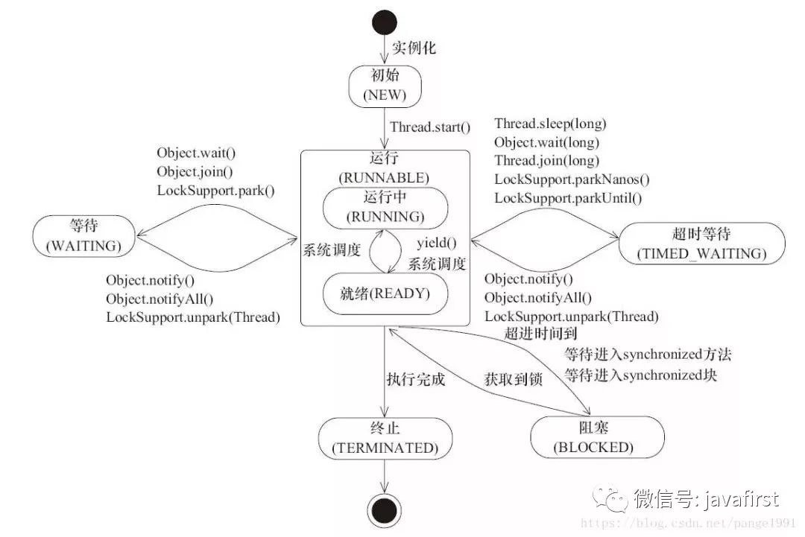

# 线程的概念

[TOC]

## 线程

线程是一个独立执行的调用序列；同一个进程的线程在同一时刻共享一些系统资源（比如文件句柄等），也能访问同一个进程所创建的对象资源（内存资源）。java.lang.Thread对象负责统计和控制这种行为。

每个程序都至少拥有一个线程 - 即作为Java虚拟机(JVM)启动参数运行在主类main方法的线程。在Java虚拟机初始化过程中，也可能启动其他的后台线程。这种线程的数目和种类因 JVM 的实现而异。然而所有用户级线程都是显式被构造并在主线程或者是其他用户线程中被启动。

这里对 Thread 类中的主要方法和属性以及一些使用注意事项作出总结。这些内容会在《Java Concurrency Constructs》这本书中进一步的讨论阐述。Java语言规范以及已发布的API文档中都会有更详细权威的描述。


## 线程的状态



Java 线程的生命周期中存在几种状态。在 Thread 类里有一个枚举类型public enum State，定义了[线程的几种状态](http://mp.weixin.qq.com/s?__biz=MzU5NTAzNjM0Mw==&mid=2247485596&idx=2&sn=05530f1d33c7e1d03ef1d884456cbfe1&chksm=fe795944c90ed052aabcc0d665d65a0d5a7767df0333666055f11417981037b65acb1e525758&scene=21#wechat_redirect)，如下。通过thread.getState()可以获取该线程的当前状态。

1. 初始(NEW)：新创建了一个线程对象，但还没有调用start()方法。

2. 运行(RUNNABLE)：Java线程中将就绪（ready）和运行中（running）两种状态笼统的称为运行(RUNNABLE)。

   在RUNNABLE状态下的线程，是正在JVM中执行的，但也可能需要等待从操作系统获取其他资源，比如处理器、比如IO。

   - 线程对象创建后，其他线程(比如main线程）调用了该线程对象的start()方法；该状态的线程位于可运行线程池中，等待被线程调度选中从而获取CPU的使用权，此时处于就绪状态（ready）。

   - 就绪状态的线程在获得CPU时间片后变为运行中状态（running）。

   Thread.yield()：向调度程序提示当前线程愿意放弃当前使用的处理器。调度程序可以随意忽略此提示。可以使线程由running状态转为ready状态。

   实际很少适用此方法，但它对调试或者测试可能很有用，因为它可能有助于重现由于竞争条件而产生的错误。

3. 阻塞(BLOCKED)：表示线程阻塞于锁。阻塞状态的线程，等待获取一个监视器锁，从而进入同步代码块/方法，或者在调用Object wait() 后重新进入同步代码块/方法。

   - 阻塞状态是线程阻塞在进入[synchronized](http://mp.weixin.qq.com/s?__biz=MzU5NTAzNjM0Mw==&mid=2247484598&idx=3&sn=f37dbbfa704fb465c8b1ef9fefc24398&chksm=fe79556ec90edc78f06934fd24f73a584a6e32ce542e3790cb3aa62a6a9f35cb32b06cfa56fa&scene=21#wechat_redirect)关键字修饰的方法或代码块(获取锁)时的状态。

   - 一旦得到锁就从阻塞状态进入运行状态。

4. 等待(WAITING)：处于这种状态的线程不会被分配CPU执行时间，它们要等待被显式地唤醒或终止(通知唤醒 Object notify()/notifyAll() 或中断Thread interpreted())，否则会处于无限期等待的状态。

   调用以下方法会进入WAITING状态：

   - Object wait() 线程等待，释放锁( 让出cpu执行权)

     线程调用一对象的wait方法后，该线程进入WAITING状态，直到其他线程调用该对象的notify/notifyAll方法后，才会唤醒这个线程进入RUNNABLE状态，重新获取CPU执行权从而继续执行。

   - Thread join() 等待该线程程结束才会到父线程

   - LockSupport.park() 线程挂起，直到调用LockSupport.park() 获得许可

5. 超时等待(TIMED_WAITING)：处于这种状态的线程不会被分配CPU执行时间，不过无须无限期等待被其他线程显示地唤醒，在达到一定时间后它们会自动唤醒。

   调用以下方法会进入TIMED_WAITING状态（指定时间必须>0，因为=0表示永久等待）：

   - Thread.sleep(**long** millis) 

     线程定时休眠：休眠时不释放锁(不释放cpu执行权)。

   - Object wait(**long** timeoutMillis) / wait(**long** timeoutMillis, **int** nanos) 

     线程定时等待：等待时释放锁(让出cpu执行权)

   - Thread join(final **long** millis) , join(**long** millis, **int** nanos)  定时等待该线程结束才回到父线程：

     join(final **long** millis)：=0 表示永久等待， >0  表示定时等待；

     join(**long** millis, **int** nanos)：定时等待，等待时长为millis(微秒) + nanos(毫秒)

     等待直到子线程结束才会到父线程，或者达到指定的时间。

   - LockSupport.parkNanos(**long** nanos)  线程定时挂起：

   - LockSupport.parkUntil(**long** deadline)  线程有期限挂起：

     线程挂起直到：获得permit，被其他线程invoke，或被interpreted，或到达期限deadline或无故调用return。

6. 终止(TERMINATED)：终止的线程的状态，表示该线程已经执行完毕。

   - 正常运行结束
   - 使用退出标志，检查符合条件时退出。
   - thread.interpreted() 线程被终止（thread.stop()  不安全，已禁用）

```java
public class ThreadSateTest {
	public static void main(String[] args) throws InterruptedException {
		Thread t = new Thread(new Runnable() {
			@Override
			public void run() {
				System.out.println(Thread.currentThread().getState());//RUNNABLE
				try {
					Thread.sleep(1000);
				} catch (InterruptedException e) {
					System.err.println(e.getMessage());
					e.printStackTrace();
				}
			}
		});
		System.out.println(t.getState());//NEW
		
		t.start();
		//then print RUNNABLE from run()
		
		System.out.println(t.getState());//TIMED_WAITING
		
		t.join();
		System.out.println(t.getState());//TERMINATED
	}
}
```


## Thread.java 类代码段

几种构造方法：


```java
   // Thread.java 代码段
   public Thread(Runnable target) {
        this(null, target, "Thread-" + nextThreadNum(), 0);
    }
     /* @param  group
     *         the thread group. If {@code null} and there is a security
     *         manager, the group is determined by {@linkplain
     *         SecurityManager#getThreadGroup SecurityManager.getThreadGroup()}.
     *         If there is not a security manager or {@code SecurityManager.getThreadGroup()} returns {@code null}, the group is set to the current thread's thread group.
     *
     * @param  target: the object whose {@code run} method is invoked when this thread is started. If {@code null}, this thread's run method is invoked.
     * @param  name: the name of the new thread
     * @param  stackSize: the desired stack size for the new thread, or zero to indicate that this parameter is to be ignored
     * @param  inheritThreadLocals: if {@code true}, inherit initial values for inheritable thread-locals from the constructing thread, otherwise no initial values are inherited
     *
     * @throws  SecurityException: if the current thread cannot create a thread in the specified thread group
     *
     * @since 9
     */
    public Thread(ThreadGroup group, Runnable target, String name,
                  long stackSize, boolean inheritThreadLocals) {
        this(group, target, name, stackSize, null, inheritThreadLocals);
    }

    @Override
    public void run() {
        if (target != null) {
            target.run();
        }
    }
```


## thread.start() 启动线程、 thread.run() /runnable.run()运行线程体

- start() ：启动线程，初始化Thread类的实例的run()方法。
- run()  ：运行线程体，即run()方法中的具体代码；
- isAlive()：在线程start()之后终止之前，返回true；

当一个线程类同时实现Runnable和继承Thread时，只有重写的Thread的run方法会被执行。

（当Thread的run方法没有重写时，才会执行Runnable的run方法。）

```java
 Thread t = new Thread(new Runnable() {
		@Override
		public void run() {
			System.out.println(" do runnable run..."); //not work
		}	
	}) {
		@Override
		public void run() {
			System.out.println(" do thread run..."); //this work
		}
	};
	
  t.start();
```


## thread.setPriority()设置线程优先级

JVM为了实现跨平台(不同的硬件平台和各种操作系统)的特性，Java语言在线程调度与调度公平性上未作出任何的承诺，甚至都不会严格保证线程会被执行。但是Java线程却支持优先级的方法，这些方法会影响线程的调度：每个线程都有一个优先级，分布在 Thread.MIN_PRIORITY 和 Thread.MAX_PRIORITY之间（分别为1和10）。

- 默认情况下，新创建的线程都和创建它的线程拥有相同的优先级。main方法所关联的初始化线程拥有一个默认的优先级，这个优先级是Thread.NORM_PRIORITY (5)。
- 线程的当前优先级可以通过getPriority方法获得。
- 线程的优先级可以通过setPriority方法来动态的修改，一个线程的最高优先级由其所在的线程组限定。
- 当可运行的线程数超过了可用的CPU数目的时候，线程调度器更偏向于去执行那些拥有更高优先级的线程。
- 线程优先级对语义和正确性没有任何的影响。特别是，优先级管理不能用来代替锁机制。优先级仅仅是用来表明哪些线程是重要紧急的，当存在很多线程在激励进行CPU资源竞争的情况下，线程的优先级标识将会显得非常有用。

下表列出了不同类型任务在线程优先级设定上的通常约定。在很多并发应用中，在任一指定的时间点上，只有相对较少的线程处于可执行的状态（另外的线程可能由于各种原因处于阻塞状态），在这种情况下，没有什么理由需要去管理线程的优先级。另一些情况下，在线程优先级上的调整可能会对并发系统的调优起到一些作用。

| 范围 | 用途                                                         |
| ---- | ------------------------------------------------------------ |
| 10   | Crisis management（应急处理）                                |
| 7-9  | Interactive, event-driven（交互相关，事件驱动）              |
| 4-6  | IO-bound（IO限制类）                                         |
| 2-3  | Background computation（后台计算）                           |
| 1    | Run only if nothing else can（仅在没有任何线程运行时运行的） |


## thread.setDaemon() 将线程设置为守护线程

在thread.start()之前，可以通过thread.setDaemon(true)将线程设置为守护线程后，当主线程结束后守护线程也会结束。在守护线程中产生的新线程也是守护线程。守护线程的

> 守护线程：也称服务线程，是后台线程，为用户线程提供公共服务，在没有用户线程可服务时会自动离开。
>
> 优先级：守护线程的优先级比较低，用于为系统中的其它对象和线程提供服务。
>
> 设置方法：在线程对象启动之前，用 setDaemon(true) 设置。在 Daemon 线程中产生的新线程也是 Daemon 的。
>
> 状态方法：isDaemon()能够返回该线程是否会守护线程的值。

```
public static void main(String[] args) {
		MyThread th1 = new MyThread("ThreadImpl1");
		MyThread th2 = new MyThread("ThreadImpl2");
		
		/* The JVM exits when the only threads running are all daemon threads.
		 * after setDaemon(true), th1 and th2 will terminate when main thread terminate
	   */
		th1.setDaemon(true);
		th2.setDaemon(true);
		
		th1.start();
		th2.start();
}
```


## 线程及其线程组

每个线程都属于一个线程组（是一个线程组中的成员）。默认，新建线程与创建它的线程属于同一个线程组。线程组以**树状分布**。当创建一个新的线程组，该线程组称为当前线程组的子组。

Thread 类的 getThreadGroup() 方法会返回当前线程所属的线程组；对应地，ThreadGroup 类也有方法可以得到目前属于这个线程组的所有线程，比如enumerate()方法。

ThreadGroup 类存在的一个目的是支持安全策略来动态的限制对该组的线程操作。比如对不属于同一组的线程调用interrupt是不合法的。这是为避免某些问题(比如，一个applet线程尝试杀掉主屏幕的刷新线程)所采取的措施。ThreadGroup也可以为该组所有线程设置一个最大的线程优先级。

线程组往往不会直接在程序中被使用。在大多数的应用中，如果仅仅是为在程序中跟踪线程对象的分组，那么普通的集合类（比如java.util.Vector）应是更好的选择。

在ThreadGroup类为数不多的几个方法中，uncaughtException() 方法却是非常有用的，当线程组中的某个线程因抛出未检测的异常（比如空指针异常NullPointerException）而中断的时候，调用这个方法可以打印出线程的调用栈信息。

## 终止线程的4种方法

### 1 线程体run()运行完毕，线程正常结束

### 2 使用退出标志，退出线程

一般 run()方法执行完，线程就会正常结束；然而，常常有些线程是伺服线程，它们需要长时间的运行，只有在外部某些条件满足的情况下，才能关闭这些线程。使用一个变量来控制循环，例如：最直接的方法就是设一个 boolean 类型的标志，并通过设置这个标志为 true 或 false 来控制 while循环是否退出，代码示例:

```java
public class ThreadSafe extends Thread { 
	public volatile boolean exit = false;
	public void run() { 
		while (!exit){
			//do something
		} 
	}
}
```

定义了一个退出标志 exit，当 exit 为 true 时，while 循环退出，exit 的默认值为 false。在定义 exit 时，使用 volatile 目的是使 exit 同步，也就是说在同一时刻只能由一个线程来修改 exit 的值。

### 3 thread.interpreted()  终止线程

线程的终止使用interpreted（stop() 已弃用）。使用 interpreted()  终止线程有两种情况：

- 线程处于阻塞状态：

  如使用了 sleep(timeout)，同步锁的 wait，socket 中的 receiver、accept 等方法时，会使线程处于阻塞状态。

  当调用线程的 interrupt()方法时，会抛出 InterruptException 异常。

  阻塞中的那个方法抛出这个异常，通过代码捕获该异常，然后 break 跳出循环状态，从而让我们有机会结束这个线程的执行。通常很多人认为只要调用 interrupt 方法线程就会结束，实际上是错的， 一定要先捕获 InterruptedException 异常之后通过 break 来跳出循环，才能正常结束 run 方法。

- 线程未处于阻塞状态：

  使用 isInterrupted()判断线程的中断标志来退出循环。当使用 interrupt() 方法时，中断标志就会置 true，和使用自定义的标志来控制循环是一样的道理。

```java
public class MyThread extends Thread{
	@Override
	public void run(){
    while (!isInterrupted()) //非阻塞过程中通过判断中断标志来退出
    {
      try
      {
					Thread.sleep(5*1000);//阻塞过程捕获中断异常来退出 
      }catch(InterruptedException e)
      {
				e.printStackTrace();
				break;//捕获到异常之后，执行 break 跳出循环 
      }
	}

	public static void main(String[] args) {
		MyThread th1 = new MyThread("ThreadImpl1");
		MyThread th2 = new MyThread("ThreadImpl2");

		th1.start();
		th2.start();
		
		th1.interrupt();//停止当前线程，并将终止状态interrupted置为true
    //th1.stop();//Deprecated, 只是无限期等待并未释放所有资源，不是真正的停止	
	}
```

### 4 thread.stop() 终止线程(不安全，自jdk1.2弃用)

程序中使用 thread.stop() 可以强行终止线程，但是 stop 方法是不安全的，主要是: thread.stop()调用之后，创建子线程的线程就会抛出 ThreadDeatherror 的错误，并且会释放子线程所持有的所有锁。一般任何进行加锁的代码块，都是为了保护数据的一致性，如果在调用 thread.stop()后导致了该线程所持有的所有锁的突然释放(不可控制)，那么被保护数据就有可能呈现不一致性，其他线程在使用这些被破坏的数据时，有可能导致一些很奇怪的应用程序错误。

因此，并不推荐使用 stop 方法来终止线程。


## 线程控制方法：

### Thread.yield() 线程让步

一定是当前线程调用此方法，当前线程放弃获取的CPU时间片，但不释放锁资源，由运行状态变为就绪状态(running>ready)，让OS再次选择线程（与其他线程一起重新竞争 CPU 时间片）。

作用：让相同优先级的线程轮流执行，但并不保证一定会轮流执行。

实际中无法保证 Thread.yield() 达到让步目的，因为让步的线程还有可能被线程调度程序再次选中。Thread.yield() 不会导致阻塞。该方法与 sleep() 类似，只是不能由用户指定暂停多长时间。

### Thread.sleep(long millis) 线程定时休眠

一定是当前线程调用此方法，导致当前线程进入TIMED_WAITING状态，但不释放对象锁，到指定时间后线程自动苏醒进入就绪状态。

作用：给其它线程执行机会的最佳方式。

>区分 Thread.sleep(interval) 与 Object .wait(interval)
>
>- sleep()属于Thread类，wait()属于Object类；
>
>- 调用sleep()方法时，线程不会释放对象锁；
>
>  sleep()方法使程序暂停执行（指定时长），让出cpu给其他线程，但它的监控器状态依然保持，当指定时间到了，又会自动恢复运行状态。
>
>- 调用wait()方法时，线程会释放对象锁，
>
>  进入该<对象的等待锁定池>，只有针对此对象调用notify()方法后，本线程才进入<对象的锁定池>，准备获取对象锁进入运行状态。


### object wait - notify / notifyAll 线程等待-唤醒

在Object.java中，定义了wait(), notify()和notifyAll()接口。

wait()的作用是让当前线程释放它所持有的对象锁，让当前线程进入 WATING 等待队列/等待状态。需要依靠notify()/notifyAll() 唤醒；或者使用 wait(long timeout)时，timeout时间到自动唤醒。

notify()和notifyAll()的作用则是唤醒当前对象上的等待的线程；notify()是唤醒单个线程，选择是随机的；而notifyAll()是唤醒在此对象监视器上等待的所有的线程。

- 对于使用synchronized修饰的同步方法，因为该类的默认实例是(this)就是同步监视器，所以可以直接调用这3方法：this.wait() , this.notify(), this.notifyAll() 。
- 对于synchronized修饰的同步代码块，同步监视器是synchronized(obj)括号里的对象，所以必须使用该对象调用这3方法: obj.wait() , obj.notify(), obj.notifyAll() 。

Object类中关于等待/唤醒的API详细信息如下：

- **notify()**：唤醒在此对象监视器上等待的单个线程。
- **notifyAll()**：唤醒在此对象监视器上等待的所有线程。
- **wait()**：等待，让当前线程处于 “等待(阻塞)状态”，“直到其他线程调用此对象的 notify() 方法或 notifyAll() 方法”，当前线程被唤醒(进入“就绪状态”)。
- **wait(long timeout)**：定时等待，让当前线程处于“等待(阻塞)状态”，“直到其他线程调用此对象的 notify() 方法或 notifyAll() 方法，或者超过指定的时间量”，当前线程被唤醒(进入“就绪状态”)。
- **wait(long timeout, int nanos)**：定时等待，让当前线程处于“等待(阻塞)状态”，“直到其他线程调用此对象的 notify() 方法或 notifyAll() 方法，或者其他某个线程中断当前线程，或者已超过某个实际时间量”，当前线程被唤醒(进入“就绪状态”)。


### thread.join() / thread.join(long millis) 

让父线程等待子线程结束之后才能继续运行。

当前线程调用子线程的join()，使当前线程进入WAITING/TIMED_WAITING状态，当前线程不会释放已经持有的对象锁。线程执行完毕或者millis时间到，当前线程一般会进入RUNNABLE状态，也可能进入BLOCKED状态（因为join是基于wait实现的）。

join()方法定义在Thread.java中:

```java
 Thread.java 源码段
   
 //join()等效于join(0),  永久等待直到该子线程结束
 public final void join() throws InterruptedException{
		join(0);
 }
 //最多等待 millis毫秒，超时直接回到主线程，主线程与子线程并发
 public final synchronized void join(final long millis)
    throws InterruptedException {
    ...
 
//最多等待 milli毫秒+nanos纳秒，超时直接回到主线程，主线程与子线程并发
 public final synchronized void join(long millis, int nanos)
    throws InterruptedException {
    ...
 }
```

用法1：

```
Thread t1 = new Thread();
Thread t2 = new Thread();
Thread t3 = new Thread();
//t1>main>t2>main>t3>main
t1.start();
t1.join();
t2.start();
t2.join();
t3.start();
t3.join();
```


用法2:

```java
public static void main(String[] args) throws InterruptedException {
		Thread t = new Thread(new Runnable() {
			@Override
			public void run() {
				try {
					Thread.sleep(5);
					System.out.println("subthread....5");
					Thread.sleep(15);
					System.out.println("subthread....20");
					Thread.sleep(10);
					System.out.println("subthread....30");
				} catch (InterruptedException e) {
					e.printStackTrace();
				}
			}
		});
		t.start();
		t.join(10);
		System.out.println("main...10");
		Thread.sleep(10);
		System.out.println("main....20");
	}
```


### LockSupport.park() / LockSupport.parkNanos(long nanos) - LockSupport.unpark(Thread)

LockSupport.parkUntil(long deadlines)，使得当前线程进入 WAITING/TIMED_WAITING 状态。对比 wait 方法，它不需要获得锁就可以让线程进入 WAITING/TIMED_WAITING 状态；

需要通过 LockSupport.unpark(Thread thread) 唤醒。

LockSupport.unpark(Thread)：使得给定线程获得许可。如果给定线程的许可尚不可用，则使它可用。如果线程被park()阻塞，则它将解锁。否则，将保证其对park()的下一次调用不会阻塞。如果给定线程尚未启动，则不能保证unpark操作完全无效。


