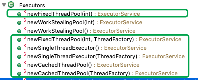

# Java线程的创建

[TOC]

# 线程的创建

Thread 的构造方法如下：


### 1 继承Thread父类：

作为Thread具体子类可直接执行。直接重写父类Thread的run方法。

### 2 实现Runnnable接口：

仅作为线程任务传给Thread执行。将任务与线程分离，以达到解耦；

### 3 通过Thread/Runnable匿名内部类创建线程

通过Runnable或Thread都可以创建匿名内部类；

```java
  //匿名内部类创建线程（同时实现Runnable并继承Thread时，只有Thread的run方法会执行）
	Thread t = new Thread(new Runnable() {
		@Override
		public void run() {
			System.out.println(" do runnable run..."); //not work
		}	
	}){
		@Override
		public void run() {
			System.out.println(" do thread run..."); //this work， this override run of runnable
		}
	};
	
	t.start();
```


### 4 创建带返回值的线程：通过Callable和FutureTask

**实现Callable<V>（参数V是返回值的类型）接口，并使用FutureTask<V>**：作为带返回值并可以抛出异常的线程任务，传入Thread执行；

```java
/**
 * @Desc   有返回值且能抛出异常的线程
 * @Author github.com/liuyuanyuan
 */
public class MyCallable implements Callable<Integer> {
	@Override
	public Integer call() throws Exception {
		System.out.println("computing...");
		return 1;
	}

	public static void main(String[] args) {
		MyCallable ct = new MyCallable();
		FutureTask<Integer> ftask = new FutureTask<>(ct);//Runnable的实现，是线程任务
		Thread t = new Thread(ftask);
		t.start();
		System.out.println("can do other things here...");
		try {
			Integer result = ftask.get();//await until done and return
			System.out.println("result = " + result);
		} catch (InterruptedException|ExecutionException e) {
			System.err.println(e.getMessage());
			e.printStackTrace();
	    } 
	}
}
```


### 5 定时器(Timer)创建多线程

-  **java.util.Timer**

定期执行定时任务，适用于简单的处理。

```
public static void main(String[] args) {
		Timer timer = new Timer();
		timer.schedule(new TimerTask() {
			@Override
			public void run() {
				System.out.println("run timer task ");
			}
		}, 0, 1000);
}
```

- **Quartz**

- **Spring**

  

### 6 线程池(以空间换时间)创建多线程

#### 线程池的创建方法

《阿里巴巴Java开发手册》中强制线程池不允许使用 Executors/ExecutorService去创建，而是通过 ThreadPoolExecutor的方式，这样更加明确线程池的运行规则，规避资源耗尽的风险。

> Executors/ExecutorService返回线程池对象的弊端如下:
>
> - FixedThreadPool 和 SingleThreadExecutor : 允许请求的队列长度为 Integer.MAX_VALUE,可能堆积 大量的请求，从而导致OOM。
> - CachedThreadPool 和 ScheduledThreadPool : 允许创建的线程数量为 Integer.MAX_VALUE ，可能 会创建大量线程，从而导致OOM。

#### 通过线程池工厂类Executors创建定参线程池：

(绿框中的方法)内部是通过ThreadPoolExecutor实现的。



- newFixedThreadPool(int) 固定数量线程池
- newCachedThreadPool() 缓存线程池
- newSingleThreadPool() 单个线程的线程池
- newScheduledThreadPool() 可定时执行线程任务的线程池


#### 通过线程池类ThreadPoolExecutor 创建自定义线程池(阿里推荐)：

```
public ThreadPoolExecutor(int corePoolSize,
                          int maximumPoolSize,
                          long keepAliveTime,
                          TimeUnit unit,
                          BlockingQueue<Runnable> workQueue,
                          ThreadFactory threadFactory,
                          RejectedExecutionHandler handler)；
```


### 7 Lambda表达式(since Java8)实现多线程

Lambda 表达式，也可称为闭包，它是推动 Java 8 发布的最重要新特性。

Lambda 允许把函数作为一个方法的参数（函数作为参数传递进方法中）。使用 Lambda 表达式可以使代码变的更加简洁紧凑。

```
public class LambdaThread {
	
	public static void main(String[] args) {
		List<Integer> values = Arrays.asList(10,20,30,40);
		int res = new LambdaThread().add(values);
		System.out.println("result=" + res);
	}

	public int add(List<Integer> values){
		//values.parallelStream().forEach(System.out::println);//并行打印，结果无序
		//values.parallelStream().forEachOrdered(System.out::println);//有序打印
		return values.parallelStream().mapToInt(i -> i).sum();	
	}
}
```


### 8 Spring Framework实现多线程

Eclipse创建Maven简单项目（preference-maven-installation&user config-create maven project - single project），进行Spring Framework（现在是SprintBoot2.2.4）的初始配置，参考官网 [Project - Spring Framework - Quick Start](https://start.spring.io)   和 [Developing Your First Spring Boot Application](https://docs.spring.io/spring-boot/docs/2.2.4.RELEASE/reference/html/getting-started.html#getting-started-first-application) 。

```java
@SpringBootApplication
@EnableAsync
public class AppConfig {
	
	//just for test
	public static void main(String[] args) {
		//SpringApplication.run(AppConfig.class, args);
		AnnotationConfigApplicationContext ac = 
				new AnnotationConfigApplicationContext(AppConfig.class);
		DemoService ds = ac.getBean(DemoService.class);
		ds.a();
		ds.b();
	}
}

@Service
public class DemoService {
	@Async
	public void a() {
		while(true) {
			System.out.println("a---");
			try {
				Thread.sleep(1000);
			} catch (InterruptedException e) {
				e.printStackTrace();
			}
		}
	}
	
	@Async
	public void b() {
		while(true) {
			System.out.println("b---");
			try {
				Thread.sleep(1000);
			} catch (InterruptedException e) {
				e.printStackTrace();
			}
		}
	}
}

```


